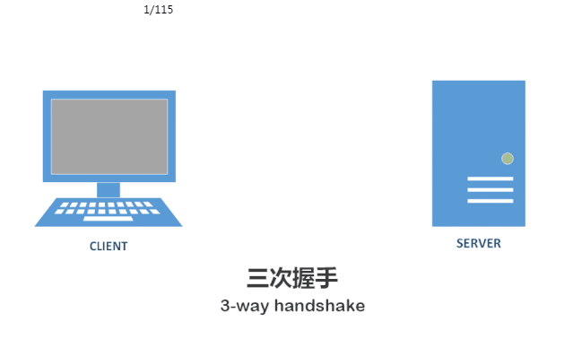

# TCP
## TCP 三次握手（Three-Way Handshake）

**三次握手即 TCP 连接的建立。这个连接必须是一方主动打开，另一方被动打开的。**

握手之前主动打开连接的客户端结束 CLOSED 状态，被动打开的服务器端也结束 CLOSED 状态，并进入 LISTEN 状态。随后开始三次握手：

1. 第一次握手：客户端发送 SYN 报文段（请求建立连接），将 SYN 置为 1，Sequence Number 为 x；然后，客户端进入 SYN_SEND 状态，等待服务器的确认；

2. 第二次握手：服务器收到客户端的 SYN 报文段，需要对这个 SYN 报文段进行确认，设置 Acknowledgment Number 为 x + 1 (Sequence Number + 1)；同时，自己自己还要发送 SYN 请求信息，将 SYN 置为 1，Sequence Number 为 y；服务器端将上述所有信息放到一个报文段（即 SYN + ACK 报文段）中，一并发送给客户端，此时服务器进入 SYN_RECV 状态；

3. 第三次握手：客户端收到服务器的 SYN + ACK 报文段。然后将 Acknowledgment Number 设置为 y + 1，向服务器发送 ACK 报文段，这个报文段发送完毕以后，客户端和服务器端都进入 ESTABLISHED 状态，完成 TCP 三次握手。

## TCP四次挥手（Four-Way Wavehand）
**四次挥手即 TCP 连接的释放(关闭)。连接的释放必须是一方主动释放，另一方被动释放。**

四次挥手的流程：

1. 第一次挥手：客户端结束 ESTABLISHED 状态并设置 Sequence Number 和 Acknowledgment Number，向服务器发送 FIN 报文段（请求释放连接）；然后客户端进入 FIN_WAIT_1 状态，即半关闭状态；这表示客户端没有数据要发送给服务器了；

2. 第二次挥手：服务器收到客户端发送的 FIN 报文段，确认客户端想要释放连接，随后服务器由 ESTABLISHED 进入 CLOSE-WAIT 状态（半关闭状态）并返回 ACK 报文段，Acknowledgment Number 为 Sequence；客户端收到从服务器端发出的 ACK 报文之后，确认服务器收到了客户端发出的释放连接请求，随后客户端进入 FIN-WAIT-2 状态；

3. 第三次挥手：服务器再次向客户端发送 FIN + ACK 报文段（已经准备好释放连接了），请求关闭连接，同时服务器进入 LAST_ACK 状态；

4. 第四次挥手：客户端收到服务器发送的 FIN + ACK 报文段，向服务器发送 ACK 报文段，然后客户端进入 TIME_WAIT 状态；服务器收到客户端的 ACK 报文段以后，就关闭连接进入 CLOSED 状态；此时，客户端等待 2MSL 后依然没有收到回复，就证明服务器已正常关闭，此时，客户端也关闭连接进入 CLOSED 状态。
